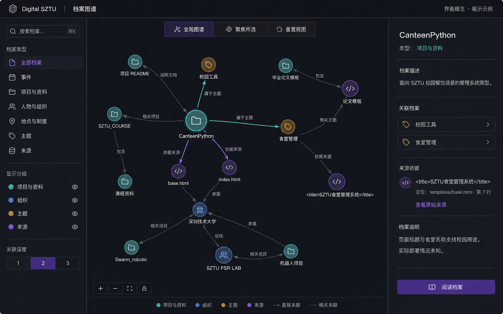

# 后续线上档案图谱界面参考

本次交付使用画布为主、按需展开筛选和详情的精简查看器。本文件仅记录后续三栏界面需求，不代表已经实现的功能。

未来可探索左侧筛选、中间图谱、右侧详情的布局，在较大档案集合中提供持续的分类上下文和阅读空间。小屏仍需折叠或切换，避免三栏压缩画布。

该图由 ImageGen 生成，仅用于布局与视觉方向讨论。图中文字、统计和连线是概念占位，均不是事实资料，不得转入档案。未来实现仍必须由正式记录生成关系，并沿用来源、反证和公开筛选规则。

本次不增加账号系统、后台编辑或 RAG 问答；这些功能需要另行定义用户流程、权限和数据契约。
